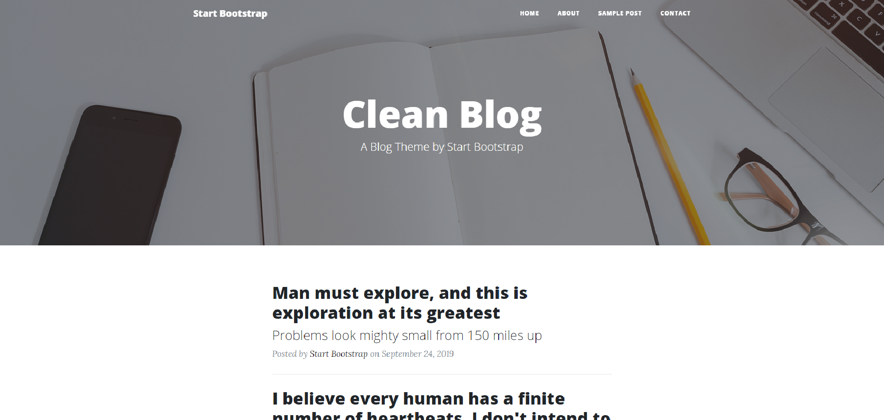
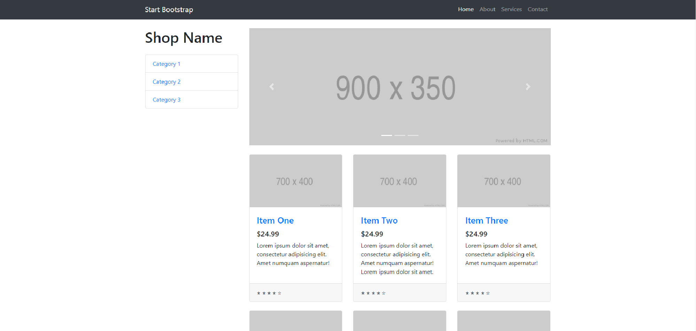

# Proyecto-DAWM
Nombre del proyecto pendiente

## Nombre del grupo
BlackSnake

## Integrantes del grupo
* Xavier Eduardo Carlier Arauz
* Carlos Humberto Jiménez Farfán
* Cristhian Andrés López Fuertes
* David Alfredo Santistevan Amat

## Descripción del proyecto
{{Nombre del proyeccto en pendiente}} es una plataforma que permite a cualquier usuario leer recetas compartidas por ciertos usuarios específicos, con la opción de realizar búsquedas y filtrado en función de lo que busquen para comer. 

## Pantalla principal
[](Plantilla/startbootstrap-clean-blog-gh-pages/homepage.html)

## Enlace al diseño
Prototipo: https://marvelapp.com/prototype/6d36862

## Enlace a la plantilla de Bootstrap
* Blog (Principal): https://startbootstrap.com/previews/clean-blog


* Frontpage: https://startbootstrap.com/previews/business-frontpage


* Vista de múltiples recetas: https://startbootstrap.com/previews/shop-homepage


## Uso de Angular
El front-end de la página web se trabajó con el framework Angular. Para trabajar en este se deben realizar los siguientes pasos

### Prerrequisitos

* Node.js (versión 8.9 o superior)
* NPM (versión 5.5.1 o superior)

### Instalación
Para instalar Angular se debe ejecutar el siguiente comando
```
$ npm install -g @angular/cli
```

### Inicialización de proyecto
Una vez clonado el repositorio e instalado Angular, se debe ejecutar el siguiente comando
```
$ npm install
```
Esto dejará listo el proyecto para trabajar sobre él.

### Probar aplicación
Para probar la aplicación se debe usar el comando
```
$ ng serve [--port ####]
```
Esto permite construir la app y colgarla en localhost en el puerto definido (si no se especifica, se usa el puerto 4200, siendo la URL localhost:4200/)